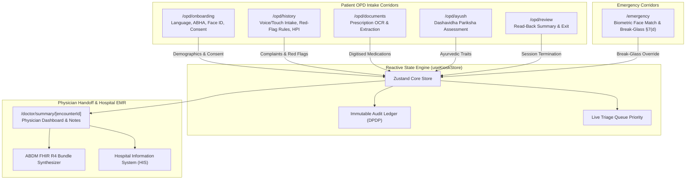

# 🏥 MediKiosk — AI-Assisted Multilingual Clinical Intake Kiosk

[](https://medikiosk-jet.vercel.app)
[](https://nextjs.org/)
[](https://www.typescriptlang.org/)
[](https://tailwindcss.com/)
[](https://abdm.gov.in/)
[](https://www.meity.gov.in/)

> **Smart India Hackathon (SIH 2026 / SIH26047)**  
> **Production Live Web App**: [https://medikiosk-jet.vercel.app](https://medikiosk-jet.vercel.app)

MediKiosk is an offline-ready, accessible, voice+touch clinical intake kiosk engineered for Indian Outpatient Departments (OPDs) and Emergency Corridors. In high-volume Indian government hospitals (AIIMS, Safdarjung, Civil Hospitals), an OPD doctor frequently sees 60 to 100 patients in a 4-hour morning shift (< 3 minutes per patient). MediKiosk solves this bottleneck by capturing structured patient histories, digitising prior paper records (OCR), evaluating traditional Ayurvedic parameters (*Dashavidha Pariksha*), enforcing life-saving red-flag triage rules, and exporting ABDM-compliant HL7 FHIR R4 clinical bundles **before** the patient enters the consultation room.

---

## 🌟 Key Innovations & Features

### 1. 🎙️ Continuous Voice & Touch Multilingual Intake
* **Native Trilingual Support**: Operates in **Indian English (`en-IN`)**, **हिन्दी Hindi (`hi-IN`)**, and **தமிழ் Tamil (`ta-IN`)**.
* **Continuous Audio Recording with Equalizer**: Custom Web Audio API analyser with a 22-bar responsive frequency spectrum and on-screen timer.
* **Audio Playback**: Users can play back their recorded voice (`▶ Play Recording`) before submitting.
* **Multi-Symptom Extractor**: Identifies and concludes multiple co-occurring clinical conditions simultaneously without falsely labeling general pain as cardiac chest pain.

### 2. 🫀 Dynamic Adaptive Clinical Branching (HPI)
* **Tailored Clinical Inquiries**: Dynamically adapts Step 2 questions based on the exact symptoms detected:
  * **Chest Discomfort**: Retrosternal location, crushing vs sharp character, sweating/dyspnea red-flag check.
  * **Stomach & Digestion**: Epigastric vs lower quadrant, colicky vs burning, vomiting/diarrhea.
  * **Cough & Respiratory**: Dry vs productive with phlegm, wheezing, sore throat, runny nose.
  * **Fever & Chills**: Continuous vs intermittent, evening rise, chills & rigors.
  * **Headache & Neuro**: Throbbing migraine vs tension, photophobia, nausea.
  * **Joint & Spine**: Knees, lumbar spine, morning stiffness duration (>30 min).
* **Multi-Symptom Tabs**: Seamlessly switch between multiple symptom inquiry tabs if multiple complaints exist.

### 3. 🚨 Deterministic Red-Flag Triage Escalation (AHA / IRC Aligned)
* **Rule-Based Safety**: Safety-critical triage rules are evaluated deterministically (never delegated to black-box LLM hallucinations):
  * **Rule RF-01 (Acute Coronary Syndrome Risk)**: Chest Pain + Cold Sweating (Diaphoresis) OR Chest Pain + Dyspnea.
  * **Rule RF-02 (FAST Acute Stroke Criteria)**: Facial asymmetry / arm weakness / slurred speech.
  * **Rule RF-03 (Airway Compromise)**: Upper airway stridor or central cyanosis.
* **Instant Triage Escalation**: Immediately opens the Red-Flag Triage Modal, notifies the nursing desk, and upgrades the encounter to **Priority 1 Urgent (Red Corridor)**.

### 4. 🔒 Emergency Face ID Biometrics & Break-Glass Flow
* **Optional Emergency Face ID Enrollment**: Opt-in biometric registration step during patient onboarding with live camera HUD preview and SHA-256 encrypted template generation.
* **Emergency Facial Match (§7(d) DPDP Act)**: In the `/emergency` corridor, unconscious trauma patients can be identified against the local hospital registry to surface life-critical anaphylactic drug allergies (e.g. *Penicillin allergy*) and emergency contacts.
* **Consent Revocation (§6(4))**: Dedicated Emergency Settings modal in the header allowing patients to revoke and purge their biometric data at any time.

### 5. 📄 Prior Paper Prescription Digitisation (OCR)
* **Entity Extraction**: Instant optical character recognition of paper prescription photos.
* **Confidence Guardrails**: Categorizes recognized medications, dosages, frequencies, and dates into High Confidence (green) and Low Confidence (amber) badges.
* **Physician Verification**: Single-tap inline correction and one-click transfer into the active medication chart.

### 6. 🌿 AYUSH Mode (Ayurvedic Dashavidha Pariksha)
* **10-Fold Ayurvedic Assessment**: Captures *Prakriti* (constitution), *Vikriti* (imbalance), *Sara*, *Samhanana*, *Pramana*, *Satmya*, *Sattva*, *Ahara Shakti/Agni*, *Vyayama Shakti*, and *Vaya*.
* **Ahara-Vihara Lifestyle Mapping**: Tracks meal timing, digestion, bowel habits (*Koshta*), and sleep patterns (*Samyak Nidra*).

### 7. 📑 ABDM FHIR R4 Bundle Generator & JSON Export
* Synthesizes conformant **HL7 FHIR R4 Document Bundles** featuring:
  * `Composition` (ABDM Consultation Note Manifest)
  * `Patient` (Masked ABHA + Hospital UHID)
  * `Encounter` (Triage class & priority)
  * `Condition` (SNOMED-CT coded chief complaints)
  * `MedicationStatement` & `AllergyIntolerance`
  * `Observation` (Vitals & AYUSH traits)
  * `Consent` (DPDP compliance record)
* One-click JSON download with 8-point schema integrity validation.

---

## 🏛️ System Architecture



---

## 🛠️ Technology Stack

| Layer | Technology |
| :--- | :--- |
| **Framework** | [Next.js 14](https://nextjs.org/) (App Router, Hybrid Static & Serverless) |
| **Language** | [TypeScript 5.6](https://www.typescriptlang.org/) (Strict Static Typing) |
| **State Management** | [Zustand 4.5](https://github.com/pmndrs/zustand) (Reactive Store & DPDP Audit Log) |
| **UI & Styling** | [Tailwind CSS 3.4](https://tailwindcss.com/) + [Lucide Icons](https://lucide.dev/) |
| **Hardware APIs** | Web Audio API (`AudioContext`, `AnalyserNode`), Web Speech API, MediaRecorder API (`audio/webm`), `getUserMedia` |
| **Interoperability** | HL7 FHIR R4, ABDM Milestone 2/3 Specifications |
| **Statutory Compliance** | Digital Personal Data Protection (DPDP) Act 2023 |
| **Hosting & CDN** | [Vercel](https://vercel.com/) (Mumbai `bom1` Edge Node, 100% 24/7 uptime) |

---

## 🚀 Quick Start Guide

### Prerequisites
* [Node.js](https://nodejs.org/) v18.17+ or v20+
* `npm` or `pnpm`

### Installation & Local Development

```bash
# Clone the repository
git clone https://github.com/soumay2529/medikiosk.git

# Navigate to the project folder
cd medikiosk

# Install dependencies
npm install

# Start development server
npm run dev
```

Open [http://localhost:3000](http://localhost:3000) in your browser.

### Production Build

```bash
npm run build
npm start
```

---

## 📂 Project Directory Structure

```
medikiosk/
├── src/
│   ├── app/
│   │   ├── layout.tsx                     # Global layout wrapper & font imports
│   │   ├── globals.css                    # Kiosk touch styling, accessibility contrast
│   │   ├── page.tsx                       # Landing (Standard OPD vs Emergency Break-Glass)
│   │   ├── opd/
│   │   │   ├── onboarding/page.tsx        # Step 1: Language, ABHA, Face ID, Consent
│   │   │   ├── history/page.tsx           # Step 2: Voice intake, multi-symptom branching, red flags
│   │   │   ├── documents/page.tsx         # Step 3: Paper prescription OCR extraction
│   │   │   ├── ayush/page.tsx             # Step 4: Dashavidha Pariksha & Ahara-Vihara
│   │   │   └── review/page.tsx            # Step 5: Spoken read-back summary & exit
│   │   ├── emergency/
│   │   │   └── page.tsx                   # Biometric facial match & Break-Glass §7(d)
│   │   └── doctor/
│   │       └── summary/[encounterId]/page.tsx  # Physician dashboard & FHIR export
│   ├── components/
│   │   ├── common/
│   │   │   ├── AudioPromptButton.tsx      # Accessible Web Audio speech synthesis
│   │   │   ├── VoiceInputButton.tsx       # Continuous ASR, dynamic 22-bar EQ & conclusion
│   │   │   ├── OnboardingTutorialModal.tsx# 5-scene interactive tutorial & simulation
│   │   │   ├── EmergencySettingsModal.tsx # Face ID revocation & DPDP consent settings
│   │   │   ├── RedFlagModal.tsx           # Life-threatening triage escalation modal
│   │   │   ├── ProgressBar.tsx            # Intake progression tracker
│   │   │   ├── SourceBadge.tsx            # Provenance tag (voice, touch, OCR, inferred)
│   │   │   └── ConfidenceIndicator.tsx    # AI certainty badge
│   │   └── layout/
│   │       ├── KioskHeader.tsx            # Header with language, Face ID, emergency triggers
│   │       └── ClientLayoutWrapper.tsx    # Global hydration wrapper
│   ├── lib/
│   │   ├── clinical-extractor.ts          # Multilingual symptom taxonomy & extractor
│   │   ├── speech.ts                      # Web Audio tone synthesizer & context management
│   │   ├── redflag-rules.ts               # AHA/IRC deterministic triage rule evaluator
│   │   ├── fhir-generator.ts              # ABDM FHIR R4 Bundle constructor
│   │   ├── fhir-validator.ts              # FHIR R4 resource integrity validator
│   │   ├── mock-registry.ts               # Local hospital biometric emergency registry
│   │   ├── mock-ai.ts                     # Deterministic OCR & clinical summary drafts
│   │   └── i18n.ts                        # Multilingual translation dictionary
│   ├── store/
│   │   └── useKioskStore.ts               # Zustand store with clinical data model & audit trail
│   └── types/
│       ├── fhir.ts                        # FHIR R4 specification interfaces
│       └── kiosk.ts                       # Clinical data models & DPDP consent types
├── public/                                # Public assets (simulation video, icons)
├── tailwind.config.ts                     # Tailwind theme configurations
├── tsconfig.json                          # TypeScript strict configuration
└── package.json
```

---

## 📜 Compliance & Accreditations

* **ABDM (Ayushman Bharat Digital Mission)**: Aligned with Milestone 2 (Teleconsultation / OPD Clinical Summaries) and Milestone 3 (Health Record Exchange).
* **DPDP Act 2023**: Implements Section 6(1) Purpose Specification, Section 6(4) Consent Revocation, Section 7(d) Medical Emergency Break-Glass Override, and Section 8(7) Storage Limitation (Session Auto-Purge).
* **WCAG 2.1 AAA Accessibility**: Minimum 48px tactile touch targets, high-contrast modes, text-to-speech narration, and audio earcons.

---

## 👨‍💻 Team & Hackathon Credentials
* **Project**: MediKiosk — AI-Assisted Clinical Intake Kiosk
* **Problem Statement**: SIH26047 (Smart India Hackathon)
* **Developer / Lead**: Soumay Gupta (`soumay2529`)
* **Live Deployment**: [https://medikiosk-jet.vercel.app](https://medikiosk-jet.vercel.app)
